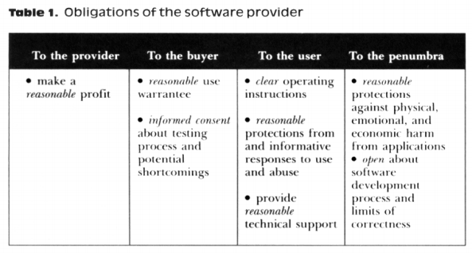
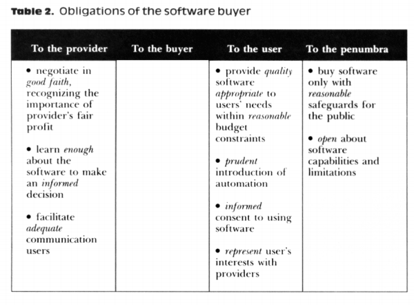


<h1 class="text-center">{{ page.mtg_date }}</h1>

### Today:
* CBC: [U.K. considers direct regulation of social media companies](https://www.cbc.ca/news/technology/uk-direct-regulation-social-media-companies-1.5088571)
* CBC: [Use of Facebook targeting on job ads could violate Canadian human rights law, experts warn](https://www.cbc.ca/news/politics/facebook-employment-job-ads-discrimination-1.5086491)

* 
* 

* Slides 11-17: <https://slideplayer.com/slide/9530210/>

* [Final Exam Discussion](https://urcourses.uregina.ca/mod/forum/discuss.php?d=522728)


